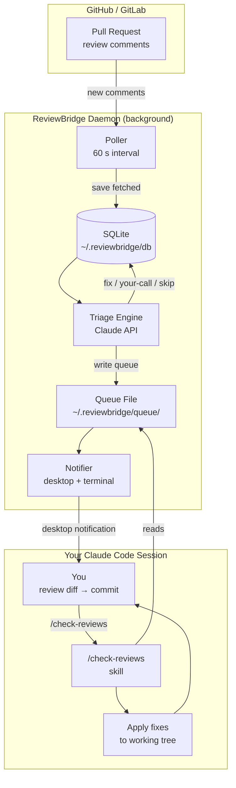

# ReviewBridge

> Stop copy-pasting review comments into Claude Code. ReviewBridge watches your PRs, triages comments with Claude, and surfaces them directly in your active session via `/check-reviews`.

[](https://go.dev)
[](LICENSE)
[](#installation)

---

## The Problem

When using Claude Code, addressing PR review comments is a constant context switch:

1. Get notified a reviewer left comments
2. Open GitHub/GitLab, read them
3. Copy each comment into Claude Code manually
4. Switch back to verify
5. Repeat for every round of review

ReviewBridge eliminates steps 2–4. The daemon watches your PRs in the background, triages every comment with Claude, and when you're ready — `/check-reviews` in your active session does the rest.

---

## How It Works

```
GitHub PR / GitLab MR
  └── new review comment from anyone (human, Copilot, CodeRabbit...)
          │
          ▼
  ReviewBridge daemon                    [running in background]
  ├── polls every 60 s
  ├── triages with Claude API
  │     ✅ fix        — clear bug or correctness issue
  │     ⚠️  your-call — valid but needs your judgment
  │     ❌ skip       — style nit, ignore
  └── writes  ~/.reviewbridge/queue/<branch>.json
          │
          ▼
  Desktop notification
  "Run /check-reviews in your Claude Code session"
          │
          ▼
  You type /check-reviews inside Claude Code
  ├── ✅ fix comments  → applied immediately, no question asked
  ├── ⚠️  your-call    → Claude explains the trade-off, you decide
  └── changes left unstaged — you review the diff and commit yourself
```

---

## Architecture



---

## Features

- **Works with any reviewer** — humans, Copilot, CodeRabbit, any bot that leaves PR comments
- **No session conflicts** — never hijacks your active Claude Code session; the `/check-reviews` skill runs inside it on your terms
- **Triage first** — Claude pre-evaluates every comment before you see it; junk and style nits are silently dropped
- **Offline-safe** — daemon catches up on all missed comments on restart
- **You own the commit** — fixes are applied to your working tree unstaged; you review, adjust if needed, then commit yourself
- **Platform agnostic** — GitHub and GitLab (including self-hosted)
- **Zero CGO** — pure Go, no system libraries required

---

## Installation

### macOS

```bash
brew install reviewbridge
```

### Linux

Download the pre-built binary:

```bash
# Replace X.Y.Z with the latest version from the Releases page
curl -L https://github.com/ahmedennaime/reviewbridge/releases/latest/download/reviewbridge-linux-amd64.tar.gz | tar xz
sudo mv reviewbridge /usr/local/bin/
```

Or with Go:

```bash
go install github.com/ahmedennaime/reviewbridge/cmd/reviewbridge@latest
```

Desktop notifications on Linux require `notify-send`:
```bash
# Debian / Ubuntu
sudo apt install libnotify-bin

# Arch
sudo pacman -S libnotify

# Fedora
sudo dnf install libnotify
```

### From Source

```bash
git clone https://github.com/ahmedennaime/reviewbridge
cd reviewbridge
make build
sudo cp bin/reviewbridge /usr/local/bin/
```

---

## Quick Start

```bash
# 1. First-time setup — validates your keys and writes ~/.reviewbridge/config.yaml
reviewbridge init

# 2. Install the /check-reviews skill into Claude Code
reviewbridge install-skill

# 3. Start the background daemon
reviewbridge start

# That's it. ReviewBridge now watches your PRs.
# When new comments arrive you'll get a desktop notification.
# Open Claude Code in your repo and run:
#   /check-reviews
```

---

## The `/check-reviews` Skill

`reviewbridge install-skill` installs a slash command into Claude Code at `~/.claude/commands/check-reviews.md`.

Inside any Claude Code session, type `/check-reviews` to:

1. Read pending comments for the current branch
2. Apply all `fix`-verdict changes immediately (already triaged, no second ask)
3. Pause on `your-call` items to explain the trade-off and ask your preference
4. Leave all changes **unstaged** — you review the diff and commit yourself
5. Delete the queue file so future runs start clean

The daemon does **not** need to be running for `/check-reviews` to work. The queue file is written once by the daemon; the skill reads it whenever you're ready.

---

## Commands

| Command | Description |
|---|---|
| `reviewbridge init` | Guided first-time setup (validates API keys) |
| `reviewbridge start` | Start the daemon in the background |
| `reviewbridge stop` | Stop the daemon |
| `reviewbridge status` | Show tracked sessions and linked PRs/MRs |
| `reviewbridge queue` | View pending review comments |
| `reviewbridge link` | Manually link a session to a branch or PR |
| `reviewbridge install-skill` | Install the `/check-reviews` Claude Code skill |
| `reviewbridge update` | Check for a newer version |

---

## Configuration

`~/.reviewbridge/config.yaml` — generated by `reviewbridge init`.

```yaml
anthropic_api_key: sk-ant-...

platforms:
  github:
    token: ghp_...
    polling_interval: 60s
  gitlab:
    token: glpat-...
    url: https://gitlab.com        # or your self-hosted instance
    polling_interval: 60s

triage:
  auto_skip_style_comments: true
  min_confidence: medium

notifications:
  desktop: true
  terminal: true
```

You can use environment variables instead of the config file — `ANTHROPIC_API_KEY` and `GITHUB_TOKEN` are picked up automatically.

---

## Requirements

| Requirement | Notes |
|---|---|
| [Claude Code](https://claude.ai/code) | `claude` must be on your PATH |
| Anthropic API key | Used for comment triage |
| GitHub token | `repo` scope, for reading PR comments |
| GitLab token | Optional, for GitLab MR support |

---

## Development

### Prerequisites

- Go 1.26.3+
- Docker (for integration and E2E tests only)

### Setup

```bash
git clone https://github.com/ahmedennaime/reviewbridge
cd reviewbridge
cp .env.example .env    # fill in your keys for local testing
```

### Build & Run

```bash
make build
./bin/reviewbridge start
```

### Testing

```bash
# Unit tests — no external dependencies
make test

# Integration tests — uses Docker WireMock, no real credentials
make test-integration

# End-to-end tests
make test-e2e

# Coverage report
make test-cover

# Lint
golangci-lint run ./...
```

---

## License

MIT — see [LICENSE](LICENSE).
